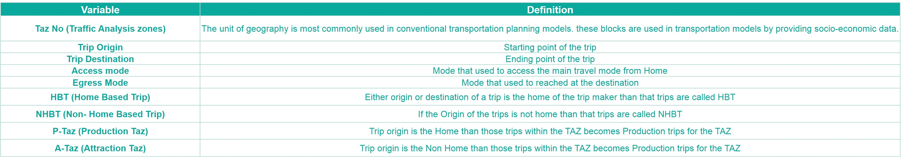

```{r setup, include=FALSE}
knitr::opts_chunk$set(echo = TRUE)
setwd("C:\\Users\\acer\\OneDrive\\Desktop\\6. Final Semester Project")
df_city <- readxl::read_excel("Rajkot_Final_Analysis_R.xlsx", sheet="Trip_Details")
df_ipts <- readxl::read_excel("Rajkot_Final_Analysis_R.xlsx", sheet="IPTS")
df_iptp <- readxl::read_excel("Rajkot_Final_Analysis_R.xlsx", sheet="IPTP")
df_pt <- readxl::read_excel("Rajkot_Final_Analysis_R.xlsx", sheet="PT")
df_city_Household <- readxl::read_excel("Rajkot_Final_Analysis_R.xlsx", sheet="Household_Data")
df_city_Vehicle <- readxl::read_excel("Rajkot_Final_Analysis_R.xlsx", sheet="Vehicle_Ownership_Details")
df_city_Member <- readxl::read_excel("Rajkot_Final_Analysis_R.xlsx", sheet="Household_Member_Data")
df_population <- readxl::read_excel("Rajkot_Final_Analysis_R.xlsx", sheet="Population")
df_Data <- readxl::read_excel("Rajkot_Final_Analysis_R.xlsx", sheet="Data")
df_count <- readxl::read_excel("Rajkot_Final_Analysis_R.xlsx", sheet="vehicle_count")
df_Future <- readxl::read_excel("Future_Trends.xlsx")

library(flexdashboard)
library(tidyverse)
library(dplyr)
library(ggplot2)
library(shiny)
library(stringr) 
library(rsconnect)
library(unikn)
library(hrbrthemes)
library(leaflet)
library(geojsonR)
library(rgdal)
library(plotly)
```

# **City Overview**

Row {data-height=500}
-----------------------------------------------------------------------

```{r pressure, echo=FALSE, out.width = '100%'}
knitr::include_graphics("Hospital Chowk.png")
```


Row {data-width=1800}
-----------------------------------------------------------------------

### **City Area**

```{r, echo=FALSE}
renderValueBox({
  valueBox(value = "689 Sq. Km")  
})
```

### **City Population**

```{r, echo=FALSE}
renderValueBox({
  valueBox(value = "19.8 Lakhs")  
})
```

### **Literacy Rate**

```{r, echo=FALSE}
renderValueBox({
  valueBox(value = "82.2%")  
})
```

### **Average Household Income**

```{r, echo=FALSE}
renderValueBox({
  valueBox(value = 27250)  
})
```

### **Average Trip Length**

```{r, echo=FALSE}
renderValueBox({
  a <- df_city %>% select(In_Vehicle_Kms) %>% summarize(x=mean(In_Vehicle_Kms)) 
  valueBox(value = a) 
})
```

### **Common Travel Mode**

```{r, echo=FALSE}
renderValueBox({
  a <- df_city %>%
    select(Travel_Mode) %>%
    group_by(Travel_Mode) %>%
    mutate(count = n()) %>%
    summarise(a = max(count)) %>%
    arrange(desc(a))%>%
    filter(row_number()==1) %>%
    select(Travel_Mode)
  valueBox(value = a)
})
```

Row 
-----------------------------------------------------------------------

### **About Rajkot** {data-width=600}

* Rajkot is a city of Gujarat state in India and administrative headquarters of the Rajkot District, located on the banks of the Aji River and Niari River. 
* Rajkot is located at 22.3° N 70.78° E. It has an average height of 134 metres. The city is spread in the area of 129.21 square km. 
* Rajkot was the former capital of the princely state of Saurashtra. Rajkot was once a base for the Western States British government office and rapidly expanded into a prosperous, lively business centre, with an old city. 
* This city is also associated with the Mahatma Gandhi, who lived here for several years. 
* Rajkot was the capital of the Saurashtra state from 15 April 1948 to 31 October 1956 before merging in bilingual Bombay State on 1 November 1956. 
* Rajkot was merged into Gujarat State from bilingual Bombay state on May 1, 1960. 
* Today, the city of Rajkot is the home of several temples. 
* During summers, the temperature ranges between 24°C and 42°C. In winter, the temperature varies between 10°C and 24°C. 
* The best time to visit Rajkot is between the months of October and March. The weather of Rajkot is the most pleasant at this time of the year


### **Location Map** {data-width=1200}

```{r, echo=FALSE}
topoData <- readLines("TAZ.json") %>% paste(collapse = "\n")
leaflet() %>% setView(lng = 70.80172422108436, lat = 22.293485969240848, zoom = 12) %>%
  addTiles() %>%
  addTopoJSON(topoData, weight = 1, color = "#444444", fill = FALSE)
```

Row {data-width=1800}
-----------------------------------------------------------------------

### **Calling Planners**

**Calling all city planners, automakers and policy makers – let’s change the way the world moves"**

Row {data-width=1800}
-----------------------------------------------------------------------
### **©mnsyt**

* You are permitted to use the contents of Rajkot City Analysis in online, offline and social media and other publication channels for non-commercial purposes with clear reference to **©mnsy** as its main source.

* You are not permitted to modify, compile, adapt or use any part of this website in any way for commercial purposes without a written agreement from **©mnsy**.

# **Demographic Profile**

Row {data-width=1800}
-----------------------------------------------------------------------
### **Average HH Size**

```{r, echo=FALSE}

renderValueBox({
  a <- df_city_Household %>% select(Family_Size) %>% summarize(mean(Family_Size))
  valueBox(value = a)
})
```

### **Male Female Ratio**

```{r, echo=FALSE}
renderValueBox({
  a <- df_city_Member %>% select(`F/ M/T`) %>% group_by(`F/ M/T`) %>% filter(`F/ M/T` == 'Male') %>% count()
  b <- df_city_Member %>% select(`F/ M/T`) %>% group_by(`F/ M/T`) %>% filter(`F/ M/T` == 'Female') %>% count()
  valueBox(value = a$n/b$n)
})
```

### **Dominant Age Group**

```{r, echo=FALSE}
renderValueBox({
  valueBox(value = "30 - 35 years")  
})
```

### **Dominant Occupation**

```{r, echo=FALSE}
renderValueBox({
  a <- df_city_Member %>%
    select(Occupation) %>%
    group_by(Occupation) %>%
    filter(Occupation != 'Housewife')  %>%
    mutate(count = n()) %>%
    summarise(a = max(count)) %>%
    arrange(desc(a))%>%
    filter(row_number()==1) %>%
    select(Occupation)
  valueBox(value = a)  
})
```


Row 
-----------------------------------------------------------------------
### **Input Location** {data-width=450}

```{r, echo=FALSE}
selectInput("Location", label = "City Location", choices = c(df_population$Location), selected = "Krishna chowk")
```

* Based on the Location selected, the interactive values generated below will let the user know the demographic characteristics. 

### **TAZ wise Population Map** {data-width=1350}

```{r, echo=FALSE}
human = makeIcon("human.png", 18, 18)
a= paste(df_population$Location, df_population$Population...4, sep = "-")
population <- leaflet() %>% addTiles() %>% setView(lng = 70.80172422108436, lat = 22.293485969240848, zoom = 12) %>% addCircleMarkers(lat=df_population$latitude, lng=df_population$longitude, radius =0.0004*df_population$Population...4, color = "red") %>% addMarkers(lat=df_population$latitude, lng=df_population$longitude, icon = human, popup= a)
population
```

TAZ based Demographic Details Row {data-width=1800}
-----------------------------------------------------------------------
### **Average HH Size** 

```{r, echo=FALSE}

renderValueBox({
  a <- df_city_Household %>% filter(Location == input$Location) %>% select(Family_Size) %>% summarize(mean(Family_Size))
  valueBox(value = a)
})
```

### **Male Female Ratio** 

```{r, echo=FALSE}
renderValueBox({
  a <- df_city_Member %>% filter(Location == input$Location) %>% select(`F/ M/T`) %>% group_by(`F/ M/T`) %>% filter(`F/ M/T` == 'Male') %>% count()
  b <- df_city_Member %>% filter(Location == input$Location) %>% select(`F/ M/T`) %>% group_by(`F/ M/T`) %>% filter(`F/ M/T` == 'Female') %>% count()
  valueBox(value = a$n/b$n)
})
```

### **DOminant Age Group** 

```{r, echo=FALSE}
renderValueBox({
  valueBox(value = "30 - 35 years")  
})
```

### **Dominant Occupation**

```{r, echo=FALSE}
renderValueBox({
  a <- df_city_Member %>% filter(Location == input$Location) %>% 
    select(Occupation) %>%
    group_by(Occupation) %>%
    filter(Occupation != 'Housewife')  %>%
    mutate(count = n()) %>%
    summarise(a = max(count)) %>%
    arrange(desc(a))%>%
    filter(row_number()==1) %>%
    select(Occupation)
  valueBox(value = a)  
})
```

# **Vehicle Ownership** 

Row {data-width=1800}
-----------------------------------------------------------------------
### Average Vehicles Household
```{r, echo=FALSE}
renderValueBox({
  a <- df_city_Vehicle %>%
  select(Vehicle_Type) %>%
  summarise(a = n()/718)
  valueBox(value = a)  
})
```

### **Dominant Owned Vehicle**

```{r, echo=FALSE}
a <- df_city_Vehicle %>%
    select(Vehicle_Type) %>%
    group_by(Vehicle_Type) %>%
    mutate(count = n()) %>%
    summarise(a = max(count)) %>%
    arrange(desc(a))%>%
    filter(row_number()==1) %>%
    select(Vehicle_Type)
  valueBox(value = a, icon = "fa-city")
```

### **Average Vehicle Age**

```{r, echo=FALSE}
a <- df_city_Vehicle %>%
  select(Age) %>%
  summarise(a = mean(Age))
valueBox(value = a, icon = "fa-city")
```

### **Dominant Fuel Type**

```{r, echo=FALSE}
a <- df_city_Vehicle %>%
    select(Fuel_Type) %>%
    group_by(Fuel_Type) %>%
    mutate(count = n()) %>%
    summarise(a = max(count)) %>%
    arrange(desc(a))%>%
    filter(row_number()==1) %>%
    select(Fuel_Type)
  valueBox(value = a)
```

Row {data-width=1800}
-----------------------------------------------------------------------
### **Income Vs Vehicle Type**

```{r, echo=FALSE}
renderPlot(
 df_city_Vehicle %>%
  select(`Income Range`, Vehicle_Type) %>%
  group_by(`Income Range`) %>%
  mutate(count = n()) %>%
  ggplot(aes(x = `Income Range`, y = count, fill = Vehicle_Type)) +
  geom_bar(position="fill", stat = "identity") +
  theme_classic() +
  labs(
    x = "Income",
    y = "Vehicle Type",
    title = "Income Wise Vehicle Ownership in Rajkot"
  ))
```


Row {data-width=1800}
-----------------------------------------------------------------------
### **Input Location** {data-width=450}

```{r, echo=FALSE}
selectInput("Loca", label = "City Location", choices = c(df_city_Vehicle$Location), selected = "Krishna chowk")
```

* Based on the Location selected, the interactive values generated below will let the user know in which locality of the city, most vehicles are located and of what average age.


### **TAZ wise No. of Vehicles** {data-width=1350}

```{r, echo=FALSE}
car = makeIcon("car.png", 18, 18)
df_count$total <- df_city_Vehicle %>%
  select(TAZ_No,No) %>%
  group_by(TAZ_No) %>%
  summarise(sum(No))
b = paste(df_count$Location, df_count$total, sep = "-")
cars <- leaflet() %>% addTiles() %>% setView(lng = 70.80172422108436, lat = 22.293485969240848, zoom = 12) %>% 
  addCircleMarkers(lat=df_count$latitude, lng=df_count$longitude, radius =2, color = "blue") %>% 
  addMarkers(lat=df_count$latitude, lng=df_count$longitude, icon = car, popup = b)
cars
```

Row {data-width=1800}
-----------------------------------------------------------------------

### **TAZ wise Average Age of Vehicle**

```{r, echo=FALSE}
renderValueBox({
a <- df_city_Vehicle %>%
  filter(Location == input$Loca) %>%
  select(Age) %>%
  summarise(mean(Age))
valueBox(value = a)
})
```

### **TAZ wise Total No. of vehicles**

```{r, echo=FALSE}
renderValueBox({
a <- df_city_Vehicle %>%
  filter(Location == input$Loca) %>%
  select(No) %>%
  summarise(sum(No))
valueBox(value = a)
})
```

# **City Transport**

**City Transport**

* Below are three graphs showing the hailing stands available in Rajkot for buses, share autos and autos (in decreasing order of preference based on sharing) to reduce dependence on private mode of transport

Row {data-width=1800}
-----------------------------------------------------------------------
### **Bus Network in the City**

```{r, echo=FALSE}
bus = makeIcon("bus.png", 18, 18)
renderLeaflet({
  leaflet() %>% 
  addTiles() %>% setView(lng = 70.80172422108436, lat = 22.293485969240848, zoom = 12) %>%
  addMarkers(lat=df_pt$latitude, lng=df_pt$longitude, icon=bus, popup=df_pt$Name)})
```

Row {data-width=1800}
-----------------------------------------------------------------------
### **Shared Auto Stands**

```{r, echo=FALSE}
sh = makeIcon("shared.png", 18, 18)
renderLeaflet({
  leaflet() %>% 
  addTiles() %>% setView(lng = 70.80172422108436, lat = 22.293485969240848, zoom = 12) %>%
  addMarkers(lat=df_ipts$latitude, lng=df_ipts$longitude,icon=sh, popup=df_ipts$Name) 
})
```

Row {data-width=1800}
-----------------------------------------------------------------------
### **Private Auto Stands**

```{r, echo=FALSE}
auto = makeIcon("auto.png", 18, 18)
renderLeaflet({
  leaflet() %>% 
  addTiles() %>% setView(lng = 70.80172422108436, lat = 22.293485969240848, zoom = 12) %>%
  addMarkers(lat=df_iptp$latitude, lng=df_iptp$longitude,icon=auto, popup=df_iptp$Name)
})
```

# **Mobility Pattern**

**Rajkot's Mobility Pattern**

* The graphs below are an existing analysis of Rajkot's mobility pattern.

Row {data-width=1800}
-----------------------------------------------------------------------
### **Mode share** 
```{r, echo=FALSE}
renderPlot(
 df_city %>%
  group_by(Travel_Mode) %>%
  summarize(modeshare = n()) %>%
  ggplot(aes(x = Travel_Mode, y = modeshare, fill = Travel_Mode)) +
  geom_bar(stat = "identity") +
  theme_classic() +
  labs(
    x = "Travel Modes",
    y = "Mode Share",
    title = "Mode Share in Rajkot"
  ))
```

Row {data-width=1800}
-----------------------------------------------------------------------
### **Income vs Mode share**  
```{r, echo=FALSE}
renderPlot(
 df_city %>%
  select(Income, Travel_Mode) %>%
  group_by(Income) %>%
  mutate(count = n()) %>%
  ggplot(aes(x = Income, y = count, fill = Travel_Mode)) +
  geom_bar(position="fill", stat = "identity") +
  theme_classic() +
  labs(
    x = "Income",
    y = "Mode Share",
    title = "Income Wise Mode Share in Rajkot"
  ))
```

Row {data-width=1800}
-----------------------------------------------------------------------
### **Mode share vs trip purpose**
```{r, echo=FALSE}
renderPlot(
 df_city %>%
  select(Trip_Purpose, Travel_Mode) %>%
  group_by(Trip_Purpose) %>%
  filter(Trip_Purpose != "Home",Trip_Purpose != "home") %>%
  mutate(count = n()) %>%
  ggplot(aes(x = Trip_Purpose, y = count, fill = Travel_Mode)) +
  geom_bar(position="fill", stat = "identity") +
  theme_classic() +
  labs(
    x = "Travel Pupose",
    y = "No of trips",
    title = "Trip mode V/s Purpose"
  ))
```

Row {data-width=1800}
-----------------------------------------------------------------------
### **No of trips vs. Time**  
```{r, echo=FALSE}

df_city$Journey_Start_Time <- format(as.POSIXct((df_city$Journey_Start_Time) * 86400, origin = "1970-01-01", tz = "UTC"), "%H:%M")

renderPlot(
 df_city %>%
  select(Journey_Start_Time, Travel_Mode) %>%
  group_by(Journey_Start_Time) %>%
  mutate(count = n()) %>%
  ggplot(aes(x = Journey_Start_Time, y = count)) +
  geom_bar(stat = "identity") +
  theme_classic() +
  theme(axis.text.x = element_text(angle = 90)) +
  labs(
    x = "Travel Time",
    y = "No of trips",
    title = "Trip made according to time"
  ))
```

Row {data-width=1800}
-----------------------------------------------------------------------
### **No of trips Vs Distance**
```{r, echo=FALSE}
renderPlot(
 df_city %>%
  select(In_Vehicle_Kms, `Expansion factor`) %>%
  mutate(cuts = cut(In_Vehicle_Kms, c(0,0.5,10,15, 20,25, 30,35, 40,50,60,70,80,90,100,120,140,200,240), labels = c("0.5","10","15","20","25","30","35","40","50","60","70","80","90","100","120","140","200","240"))) %>% 
  group_by(cuts) %>%
  summarise(a = sum(`Expansion factor`)) %>%
  ggplot(aes(x=cuts, y=a,group=1)) +
  geom_line(color="#aa0022", size=1.75) +
  geom_point(color="#aa0022", size=3.5) +
  ggtitle("TLFD") +
  labs(x="Travel Distance", y="Number of trips"))
```

# **Future Trends**

Row 
-----------------------------------------------------------------------
### **Input** {data-width=900}
```{r inputs, echo=FALSE}

selectInput("x", "X-Axis", choices = colnames(df_Future), selected = "Populationin_in_a_TAZ")
selectInput("y", "Y-Axis", choices = colnames(df_Future), selected = "WorkingPopulation_in_a_TAZ")

```

### **Methodology** {data-width=900}
* On the x-axis and y-axis a list of parameters are given including TAZ, the population in each TAZ (working and student) and the no. of households along with the trips based on education, work and other social activities that are generated and attracted to these TAZs.
* Based on the play of these parameters across axis, the interactive graph below will be generating the relation through regression analysis such that users can identify what parameters area affecting the no. of trips from each TAZ and if the parameters are selected are valid or not for analysis based on R2 value.


Row {data-width=1800}
-----------------------------------------------------------------------
### **No of trips Vs Distance**
```{r reactive expression, echo = FALSE}
model1 <- reactive({
  vars <- as.matrix(df_Future[, input$x])
  vars1 <- as.matrix(df_Future[, input$y])
  lm(vars ~ vars1, data = df_Future)
  
})
```

```{r model output,echo = FALSE}
renderPrint({ 
   
summary(model1())

})
```

Row {data-width=1800}
-----------------------------------------------------------------------
### **No of trips Vs Distance**

```{r, echo=FALSE}
renderPlotly({
  p <- df_Future %>% 
    ggplot(aes_string(x = input$x, y = input$y)) + 
    geom_point() +
    theme_minimal() + 
    labs(x = input$x, y = input$y)
  
  p %>% ggplotly()
})
```


# **About** 

Row {data-height=500}
-----------------------------------------------------------------------

```{r, echo=FALSE, out.width = '100%'}

```

Row {data-height=600}
-----------------------------------------------------------------------
### **Data Collection** {data-width=900}

**TAZ Distribution**

* Rajkot was divided into 141 Traffic Analysis Zones based on current area under Rajkot Munipal Corporation (RMC) and aspected growth area for planning under Rajkot Urban Development Authority (RUDA)
* The TAZs are divided based upon geographic features or infrastructure features like roads, bridges, etc.

**Survey**

* Students from CEPT University were given the task to collect data for demography, vehicle ownership and travel diaries through a pre-defined personal interview questionaire.
* With a team of 22, total surevys conducted were 3025.
* The surveys were further expanded based on city's population size for data analysis.

**Purpose of the data** :To prepare the STP for Rajkot city 2040

**Data collection Date** :January 2019 – February 2019

### **TAZ** {data-width=900}

```{r, echo=FALSE}
my_spdf <- readOGR( 
  dsn= paste0(getwd(),"\\GIS\\Final_Taz_all"), 
  layer="Final_Taz_all",
  verbose=FALSE
)
par(mar=c(0,0,0,0))
plot(my_spdf, col="#f2f2f2", bg="blue", lwd=0.25, border=0 )
```

Row {data-width=1800}
-----------------------------------------------------------------------
### **Data Preparation**

**Data Importing & cleaning process:**

* Cleaning process: The database was cleaned at the time of the survey collection and data entry in Excel to the maximum extent.
* During data analysis: Geographic locations were exported from GIS with longitude and latitude for spatial location of bus stands, auto stands and shared auto stands.


Row {data-height=400}
-----------------------------------------------------------------------
### **Data Dictionary**

```{r, echo=FALSE, out.width = 1800 }

```


Row {data-width=1800}
-----------------------------------------------------------------------
### **Summary and Conclusions**

**Purpose of Analysis**

* Descriptive Analysis: To find the demographic profile, vehicle ownership and mobility pattern details of your locality
* Predictive Analysis: To understand the relation between trips generated or attracted based on education, work and social reasons to the TAZs, population(working and students) and number of households in each TAZ.

**Summary of Descriptive Analysis**

* Rajkot with a total area of 689 Sq. Km and 19.8 lakh population has an an average household income of Rs ₹ 27250 and a average household size of 4.2 persons.
* The average age group of the city is 30-35 years and the dominant work type is students.
* The average trip length for the city travelers is 4.5 Km and the most common mode of traveling is 2-wheeler.
* On an average a household has 2 vehicles (car/2-wheeler/cycle), 5 years old and running on petrol.


**Summary of Descriptive Analysis**

* The most prominent relationship is between ----- with an R2 value of 
* ---- are least correlated.


**Conclusion of Prescriptive Analysis**

* Prescriptive analytics is a type of data analytics—the use of technology to help businesses make better decisions through the analysis of raw data. 
* Specifically, prescriptive analytics factors information about possible situations or scenarios, available resources, past performance, and current performance, and suggests a course of action or strategy. 
* It can be used to make decisions on any time horizon, from immediate to long term.
* The opposite of prescriptive analytics is descriptive analytics, which examines decisions and outcomes after the fact.


Row {data-width=1800}
-----------------------------------------------------------------------

### **Calling Planners**

**Calling all city planners, automakers and policy makers – let’s change the way the world moves"**

Row {data-width=1800}
-----------------------------------------------------------------------
### **©mnsyt**

* You are permitted to use the contents of Rajkot City Analysis in online, offline and social media and other publication channels for non-commercial purposes with clear reference to **©mnsy** as its main source.

* You are not permitted to modify, compile, adapt or use any part of this website in any way for commercial purposes without a written agreement from **©mnsy**.
